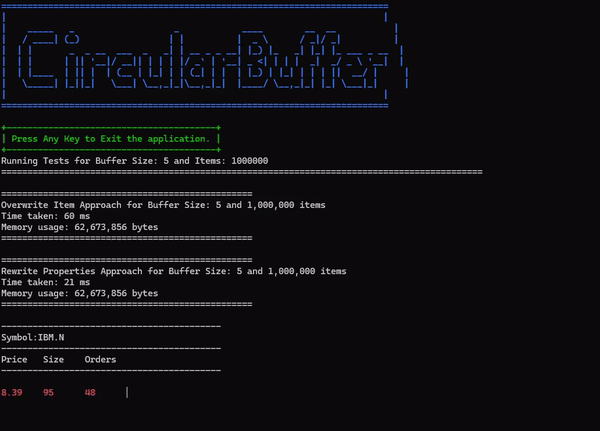

# 📊 Circular Buffer Demo: Efficient Data Handling 🚀

<div align="center">
 <pre style="color: #1E90FF;">
  _____   _                   _            ____        __  __         
 / ____| (_)                 | |          |  _ \      / _|/ _|        
| |       _  _ __  ___  _   _| | __ _ _ __| |_) |_   _| |_| |_ ___ _ __
| |      | || '__|/ __|| | | | |/ _` | '__| _ <| | | |  _|  _/ _ \ '__|
| |____  | || |  | (__ | |_| | | (_| | |  | |_) | |_| | | | ||  __/ |   
 \_____| |_||_|   \___| \__,_|_|\__,_|_|  |____/ \__,_|_| |_| \___|_|

</pre>
  <br/>
  <h1 align="center"><u>Circular Buffer</u></h1>

  <p align="center">
    Welcome to Circular Buffer!
    <p align="center">
      
    </p>
    <br/>
    <a href="https://github.com/OxyProgrammer/circular-buffer/issues">Report Issue</a>
    ·
    <a href="https://github.com/OxyProgrammer/circular-buffer/issues">Request Feature</a>
  </p>
  </div>

[](https://github.com/OxyProgrammer/go-dist/issues)
[](https://github.com/OxyProgrammer/go-dist/network)
[](https://github.com/OxyProgrammer/go-dist/stargazers)
[](https://github.com/OxyProgrammer/go-dist)

## Description

This project demonstrates the use of a **Circular Buffer** to manage high-speed market data feeds. The circular buffer is an efficient way to handle data streams, allowing for constant time insertions and deletions while maintaining data integrity.

## Table of Contents

- [Installation](#installation)
- [Usage](#usage)
- [Features](#features)
- [Contributing](#contributing)
- [License](#license)

## Installation

1. Clone the repository:

   ```bash
   git clone https://github.com/yourusername/CircularBufferDemo.git
   ```

2. Navigate to the project directory:

   ```bash
   cd CircularBufferDemo
   ```

3. Restore project dependencies:
   ```bash
   dotnet restore
   ```

## Usage

To run the demo, execute:

```bash
dotnet run
```

You will see market data being processed in real-time, demonstrating how a circular buffer handles high throughput efficiently. 📈💡

## Features

- ⚡ High-speed data processing using circular buffers.
- 🔄 Comparison with traditional queue implementations.
- 📊 Real-time demonstration of market data feeds.
- 📈 Improved memory efficiency and performance.

## Contributing

We welcome contributions! Here’s how you can help:

Fork the repository
Create your feature branch:

```bash
git checkout -b feature/AmazingFeature
```

Commit your changes:

```bash
git commit -m 'Add some AmazingFeature'
```

Push to the branch:

```bash
git push origin feature/AmazingFeature
```

Open a pull request.

## License

This project is licensed under the MIT License - see the LICENSE file for details. 📝
